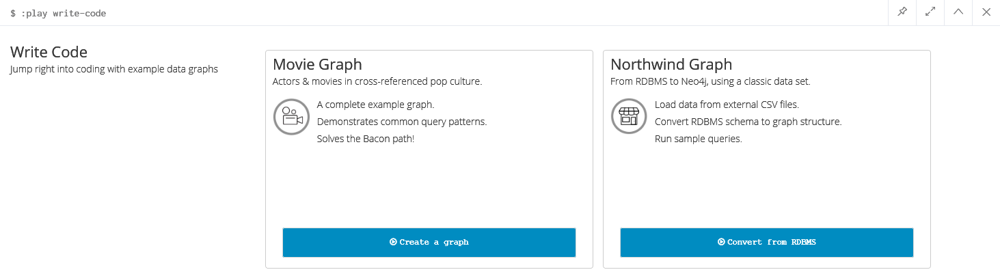
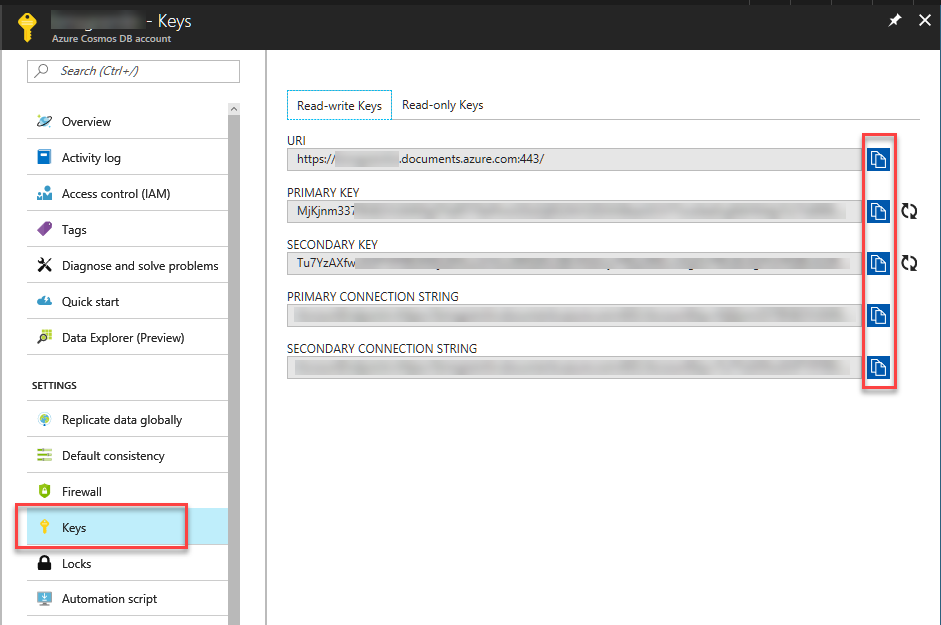

# neo-to-cosmos
[](https://hub.docker.com/r/syedhassaanahmed/neo2cosmos/)

This app takes a Neo4j database snapshot and copies all contents to an Azure Cosmos DB database using Graph (gremlin) API.

## Credits
This is an x-plat continuation of the great work **Brian Sherwin** has done [in this C# repo](https://github.com/bsherwin/neo2cosmos).

## Disclaimer
- The app is **NOT intended to run on a live production database**.
- It won't work on Cosmos DB emulator as the emulator doesn't support Graph (Gremlin) API yet.
- This project is **NOT supported by Microsoft** in any way and may become non-functional at any time. This is an independent project although we would love if you submit PRs to improve it.

## Get Started
The first thing you'll need is a Neo4j database. Docker is the quickest way to get started!

If you're on Windows, make sure you've configured Hyper-V, and installed [Docker for Windows](https://docs.docker.com/docker-for-windows/). Also make sure to use Linux containers.

Once you have that running, spin up a copy of Neo4j:

```
docker run --name neo2cosmos-neo4j -p 7474:7474 -p 7687:7687 -v $HOME/neo4j/data:/data -d neo4j
```

If you don't already have Neo4j image loaded, it will automatically be downloaded. Then, Docker will start up the image and set up both Neo4j bolt on port 7687 and Neo4j browser on port 7474. Finally, it will store all data in your user home directory under neo4j/data. This way, your data will survive container reboots.

Next, spin up Neo4j data browser by pointing to http://localhost:7474. The initial login/password will be "neo4j/neo4j" and you'll have to change the password. This password will go in the app configuration later. Start one of the code walkthroughs to load up some data.

```
:play write-code
```



```
:play movie-graph
```
or
```
:play northwind-graph
```
Walkthrough enough to completely load the data. Be careful... last step of the movie-graph will have you deleting all your new data!

## Get Your Cosmos DB ready
If you don't have Cosmos DB set up yet, head over to Azure Cosmos DB documentation and follow the instructions to [Create a Database Account](
https://docs.microsoft.com/en-us/azure/cosmos-db/create-graph-dotnet).
You don't need to create a graph, because the app will do it for you.

## Configuration
Before you run the app, you'll need to create `config.json` file with [this schema](https://github.com/syedhassaanahmed/neo-to-cosmos/blob/master/aci/config.template.json). The config contains settings to your Neo4j and Cosmos DB databases, as well as an optional Redis cache to facilitate resume scenario.

### Step 1: Get Your Cosmos DB Endpoint.


Select the Keys tab of your Azure Cosmos DB account you'll see the "URI"...copy that value to  `cosmosDb.endpoint`.

### Step 2: Get Your Cosmos DB AuthKey.
Either primary or secondary key can be used as `cosmosDb.authKey`
> Hint: Use the copy button...its way easier than trying to select it with a mouse.

### Step 3: Neo4j config
If you used the defaults, you should only need to set `neo4j.pass` to whatever you changed it to when you first logged in.

### Step 4 (Optional): Set up a Redis Server
Set up a local or remote Redis server and specify an optional `redis` value in the config. Redis allows us to resume an incomplete data migration without consuming Cosmos DB RUs. The fastest way to set up Redis is to use docker. 
```
docker run --name neo2cosmos-redis -p 6379:6379 -d redis
```

## Run the tool
`npm start` and watch your data being copied. If for some reason you couldn't transfer the data completely, simply rerun the command. For fresh clean start, do `npm start -- -r`.

### Docker
Here is how to run the containerized version of the tool.
```
docker run -it --rm -v ${pwd}/config.json:/app/config.json syedhassaanahmed/neo2cosmos
```
- `-v ${pwd}/config.json:/app/config.json` takes config file in current directory and volume mounts it inside the container.
- Add `--network "host"` in order to access local Redis and/or Neo4j.